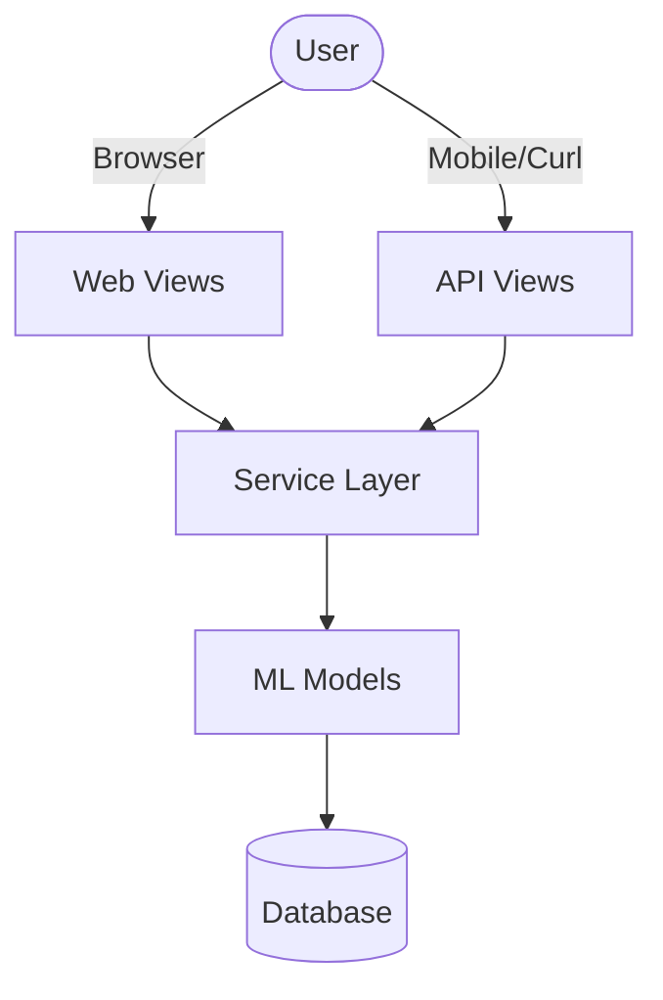

# Neurosense: Parkinson's Detection System
Neurosense is a multi-modal assessment system designed to detect early signs of Parkinson's Disease using machine learning. It integrates four distinct diagnostic modules into a unified web application.

---

## Features & Modules

### 1. Assessment Quiz (Early Screening)
*   **Method:** 20-question self-report survey.
*   **Model:** Random Forest (`parkinsons_stage_model.joblib`).
*   **Input:** User responses (Yes/No).
*   **Output:** Predicted Stage (Early/Mid/Late) and recommendation.

### 2. Spiral Drawing Analysis (Motor Check)
*   **Method:** Analysis of hand-drawn spirals for tremors and irregularity.
*   **Model:** Customized VGG16 CNN (`spiral_model.keras`).
*   **Input:** Image upload (.png, .jpg).
*   **Validation:** Checks for circularity, area, and line density to reject invalid drawings.
*   **Output:** Parkinson's Detected / Healthy.

### 3. Voice Impairment Detection
*   **Method:** Acoustic feature extraction (MFCC, Jitter, Shimmer) from speech recordings.
*   **Model:** Random Forest (`rf_model.pkl`).
*   **Input:** Audio file (.wav, .mp3).
*   **Output:** Parkinson's Detected / Healthy.

### 4. Brain MRI Scan Analysis
*   **Method:** Deep Learning analysis of MRI scans.
*   **Model:** CNN (`brain_model.h5`).
*   **Input:** MRI Image (.jpg, .png).
*   **Output:** Parkinson's Detected / Healthy.

---

## Architecture
The system follows a **Hybrid Monolithic Architecture**, ensuring robust "Dual Mode" operation where both the Web App and REST API share the same core logic.

- **Web Interface**: Traditional Django templates (MVT) for browser-based access.
- **REST API**: Stateless API using Django REST Framework (DRF) for mobile/external access.
- **Unified Service Layer**: All business logic and ML inference are encapsulated in `detection_app/api/services/prediction_service.py`, ensuring 100% logic parity.

### Request Flow


---

## Installation & Setup

### Prerequisites
*   Python 3.10+
*   pip
*   Virtual Environment (Recommended)

### 1. Clone & Install Dependencies
```bash
# Install requirements
pip install -r requirements.txt
```

### 2. Database Migrations
```bash
python manage.py makemigrations
python manage.py migrate
```

### 3. Run the Server
```bash
python manage.py runserver
```
Access the application at: `http://127.0.0.1:8000/`

---

## 🧪 Testing & Verification

### Run Unit Tests
To verify all modules (Quiz, Spiral, Voice, Brain) and web routing:
```bash
python manage.py test
```

### Run API Smoke Test
To perform a client-side verification of running endpoints:
```bash
# Ensure server is running first
python verify_api.py
```

---

## Project Structure

```
parkinson_detection_system/
├── detection_app/          # Main application
│   ├── models/             # ML Models (.h5, .joblib, .pkl)
│   ├── templates/          # HTML Templates
│   ├── tests/              # Unit Tests
│   ├── views.py            # Application Logic
│   ├── urls.py             # Routing
│   ├── spiral_predict.py   # Spiral Inference Logic
│   ├── feature_extraction.py # Voice Features
│   └── ...
├── media/                  # User uploads (spirals, audio, mri)
├── verify_api.py           # Verification Script
├── manage.py               # Django Entry Point
└── requirements.txt        # Dependencies
```

---

## Security & Safety
*   **Authentication:** All assessment pages require login.
*   **Input Validation:** Strict validation on all file uploads (Spiral, MRI).
*   **Fail-Safe:** Models include error handling to prevent server crashes if input is malformed.
